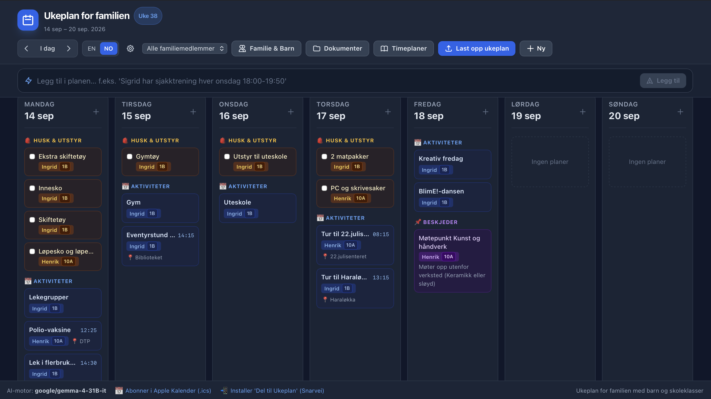

# Family Week Planner

A clean weekly family planner with custom child names & school classes (e.g. Ann: 1A, Berit: 6B, Matthew: 10C) and AI-powered extraction of school week schedules (PDF/images) and activities.



## Features

1. **Weekly Family Dashboard (Web)**:
   - 7-day responsive grid (Monday through Sunday).
   - Categorized by **🎒 Pack & Bring** (*gym kit, swimming gear, outdoor trip items*), **📅 Activities** (*trainings, matches, appointments*), **📝 Homework & Tasks**, and **📌 Notes**.
   - **"Pack for Tomorrow" header banner**: Displays what needs to be packed into backpacks for the next day.
   - Filter by family member or child (with school class indicators).
   - Manage kids and family members (add, rename, update school classes).
   - Add, edit, check off, and delete items directly.
   - **Document archive**: every uploaded plan is stored on disk, auto-tagged with the child's name and week number — browse, view, re-tag and delete at `/documents`.
   - **Standing school schedules**: one permanent timetable per child (e.g. the full school-day layout), kept separate from the weekly plan — upload, replace, view and delete at `/schedules`.

2. **Ingestion Channels**:
   - **Apple Share Sheet (Shortcut)**: Select a schedule PDF in Mail, Safari, or Files on iPhone/iPad/Mac and tap **"Share to Week Planner"**.
   - **Email Forwarding (IMAP Bot)**: Forward any school email with PDF attachments to a dedicated email inbox; background service processes it automatically.
   - **Direct Drag-and-Drop**: Upload PDF or image schedules directly via the Web UI.
   - **Natural-language command bar**: Type straight into the Web UI — e.g. `Sigrid har sjakktrening hver onsdag 18:00-19:50` — and the AI turns it into structured calendar items matched to your family members.

3. **Local AI on CPU (llama.cpp in Docker)**:
   - Runs `llama.cpp:server` inside Docker on CPU (no GPU/CUDA or Nvidia driver setup needed on the host).
   - Uses 4-bit quantized `Qwen 2.5 7B` (or `3B`), with high accuracy in parsing complex tabular schedules and dates into strict JSON.
   - **OCR stage**: set `OCR_ENABLED=true` in `.env` to transcribe PDF uploads and photo uploads through a dedicated vision model (any OpenAI-compatible endpoint, e.g. llama.cpp, vLLM/SGLang serving `zai-org/GLM-OCR`) pointed at by `OCR_BASE_URL` (default `http://localhost:8080/v1`) with `OCR_MODEL` (default `glm-ocr`). PDFs are sent whole in one call when the endpoint ingests PDFs natively (`OCR_PDF_NATIVE=true`, the z.ai API); for endpoints that only accept images (llama.cpp rejects `data:application/pdf`), set `OCR_PDF_NATIVE=false` and the pages are rendered to 150 DPI PNG (max 8) and transcribed one per page. Photos are sent as PNG. The OCR model is prompted with the canonical `OCR` trigger (GLM-OCR is prompt-limited) and produces markdown; the extraction LLM above then structures that text. When OCR is disabled or fails, PDFs fall back to their digital text layer (scanned pages then yield no text).

4. **Apple Calendar Subscription (.ics)**:
   - Provides a live subscription feed (`/api/calendar.ics`) for native iOS/macOS Calendar, syncing all activities and gear reminders onto lock screens, Apple Watch, and CarPlay.

---

## Quickstart with Docker or Podman (CPU-only)

All you need is standard Docker (or Podman) with its Compose provider installed:

```bash
# Start the full stack in the background:
docker compose up -d
```

1. **`ukeplan-llm`**: Runs `ghcr.io/ggml-org/llama.cpp:server` with `--hf-repo ${LLM_HF_REPO:-bartowski/Qwen2.5-7B-Instruct-GGUF:Q4_K_M}` on port **8089**.
2. **`ukeplan-app`**: Runs the web application and API on port 8000.

The application will be accessible at `http://localhost:8000` (or your host's local network IP).

### Using Podman instead of Docker

The same `docker-compose.yml` works with [Podman](https://podman.io/) unchanged — it uses only standard Compose features. Just swap the command:

```bash
podman compose up -d
```

(On older setups, the Python `podman-compose` package also works: `podman-compose up -d`.)

One note: the `host.docker.internal:host-gateway` entry in the compose file is a Docker idiom used only so the app can reach an OCR endpoint running on the host (disabled by default via `OCR_ENABLED=false`). Modern rootless Podman adds `host.docker.internal` to the container automatically, so nothing needs changing. If an older Python `podman-compose` errors on that line, delete the `extra_hosts` entry (the hostname still resolves) or point `OCR_BASE_URL` at `http://host.containers.internal:8080/v1` instead.

---

## Apple Devices Setup

Open `http://<your-host-ip>:8000/setup/apple-shortcut` in Safari on your iPhone or Mac:
- **Shortcut**: One-tap download of a ready-made, signed "Share to Week Planner" iOS Share Sheet shortcut (imported in Files, no Mac required). Manual step-by-step instructions are provided as a fallback if the download is unavailable.
- **Calendar**: One-click subscription URL for Apple Calendar.

---

## Optional: Email Forwarding Configuration

To enable the IMAP forwarding bot, set the following environment variables (or create a `.env` file):

```ini
IMAP_ENABLED=true
IMAP_HOST=imap.gmail.com
IMAP_PORT=993
IMAP_USER=your-family-planner@gmail.com
IMAP_PASSWORD=your-app-password
IMAP_POLL_INTERVAL_SECONDS=120
```

---

## Data Retention

The app automatically removes old data so the database and upload folder do not grow forever. A background task (at startup and then on an interval) deletes:

- **Calendar items** whose date is older than the retention window. Recurring-weekly items are standing entries and are never auto-removed.
- **Uploaded documents** (PDFs/photos) created before the retention window, including their file on disk.

Configure via environment variables (or `.env`):

```ini
ITEM_RETENTION_WEEKS=12
ITEM_PURGE_INTERVAL_SECONDS=86400
ITEM_AUTOPURGE=true
```

Set `ITEM_AUTOPURGE=false` to keep everything.
